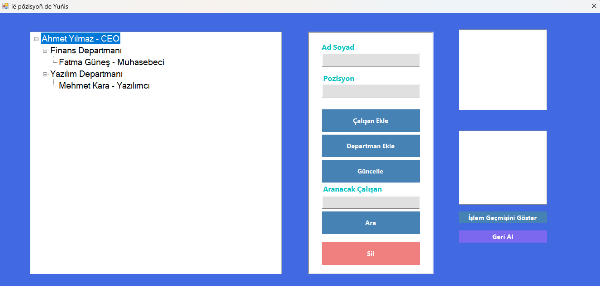

# 🧭 Organizasyon Şeması ve Şirket İçi İletişim Platformu

## 🎯 Proje Amacı
Bu proje, bir şirketin hiyerarşik yapısını görselleştirmek ve kullanıcıların organizasyon üzerinde işlemler yapabilmesini sağlamak amacıyla geliştirilmiştir.

---

## ⚙️ Özellikler

- 👨‍💼 TreeView ile yönetici > departman > çalışan yapısı
- ➕ Çalışan / Departman ekleme
- ✏️ Çalışan bilgisi güncelleme
- ❌ Çalışan / Departman silme
- 🔍 Çalışan ve pozisyon arama
- ↩️ Geri alma (Stack kullanımı)
- 🕓 İşlem geçmişi gösterimi (Queue kullanımı)
- 📋 Çalışan listesi ve pozisyon bilgileri (List + Hashtable)
- 🖼️ Geliştirilmiş arayüz, sabit pencere boyutu, modern buton tasarımı

---

## 📚 Kullanılan Veri Yapıları

| Veri Yapısı | Kullanım Alanı |
|-------------|----------------|
| Tree        | Organizasyon yapısı  
| List        | Çalışan listesi  
| Stack       | Geri alma (undo)  
| Queue       | İşlem geçmişi  
| Hashtable   | Çalışan pozisyonlarını eşlemek

---

## 🚀 Kurulum
1. WindowsFormsApp2 dosyasini klasorden cikarin.
2. Visual Studio ile `.sln` dosyasını açın  
3. `Form1.cs` üzerinden form arayüzünü görüntüleyin  
4. .NET Framework 4.x yüklü olduğundan emin olun  
5. `Başlat` butonuna tıklayarak projeyi çalıştırın

---

## 👥 Geliştirici Ekibi

- Yunis Teymurlu – [032390141] 
- Ders: Veri Yapıları  
- Dönem: Bahar 2025

---

## 🖼️ Ekran Görüntüsü

>

---

## 📝 Notlar

- README bu klasörün içindeki `README.md` dosyasıdır.  
- Geri alma sadece çalışanlar için aktiftir (departmanlar için değil).  
- Departman silme işlemi geri alınamaz.

---

## 📌 Lisans

Eğitim amaçlı geliştirilmiş bir projedir.
